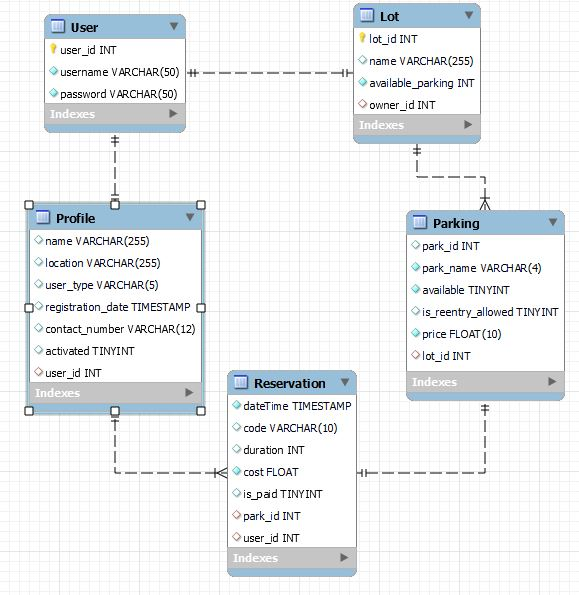

# [Parkly]() 

 Parking reservation website  

# How to start?
1. Enter The [Parkly]() website.
2. Naviagte the search page for available parking.
3. Check out and recieve your barcode.

# List of technologies used in this project:

* HTML
* CSS
* JavaScript
* Django
* Bootstrap 
* [Paypal API](https://developer.paypal.com/docs/api/overview/)
* [Mockplus WireFrame Tool](https://www.mockplus.com)
* Postgresql
* Heroku 

# Wireframes:

# Database

# User Stories:
<li> As a user, I want to have control over my profile, do that i can customize it.
<li> As a user, I want to store all of my reservations, so that I can keep accesss it.
<li> As an owner, I want the scedule of reservations to be shown, so that I can track it.
<li> As a user, I want search parking by name, so that I can reduce the navigation time.
<li> As an admin, I want to be able to recieve emails from customer, so that I can build a better customer-staff relationship. 

# Main Features:
* Signup/Signin
* Edit profile
* Search a parking
* View upcoming reservations based on the current date
* View reservation barcode
* Scan reservation barcode
* Easy pay using 3d API
* View map route.

# Future Work
<li> Parkly mobile App</li>
<li> Target bigger network</li>
<li> More payement options: MADA, COD</li>

